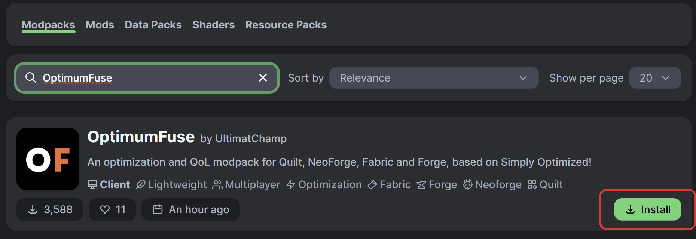

# ▶️ Getting Started

Click on your favorite launcher and follow the instructions below. If you're not
sure, you can try **Modrinth App** or **Prism Launcher**.





## Installing the Launcher

## Setup

Go through the installation process, including adding your Minecraft account!

## Installing OptimumFuse

- Click on the **Browse** button.

- Search _"OptimumFuse"_.

- You can also choose a specific variant of the modpack. The modpack, currently,
  offers two variants: **Fabric** | **NeoForge**.

## Run Minecraft

- Navigate back to **Home** and click on the modpack card.

- Click **Play**.





## Installing the Launcher

## Setup

Go through the installation process, including adding your Minecraft account!

## Installing OptimumFuse

- Click on the **Add Instance** button. 

- A new window will pop-up. Select the **Modrinth** tab, and search for _"OptimumFuse"_.

- Click on the modpack card, and click on **Ok**.

- Click the **Launch** button to start the game.





_Here are some useful links:_

- **<a href="https://apexminecrafthosting.com/how-to-play-modpacks-with-the-atlauncher/" target="_blank">How
  to Play Modpacks with the ATLauncher - Apex Hosting</a>**





**Minecraft Launcher** is not supported.





Refer to your launcher's documentation.





Now you're ready to enjoy your new, enhanced Minecraft experience!
